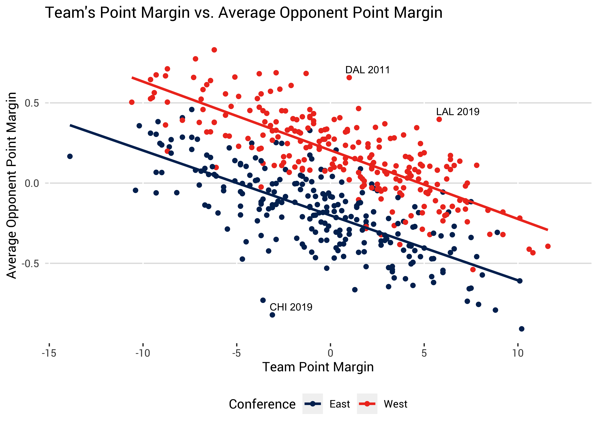

```{r set options, include=FALSE}
# DO NOT CHANGE THE LINE BELOW
knitr::opts_chunk$set(echo = TRUE)
```

``` {css styling, echo=FALSE}

<style>
.tocify {
max-width: 175px !important;
}
</style>

<style>
.main-container {
width: 100%;
max-width: 940px;
margin-left: 250px;
margin-right: auto;
}
</style>

```

```{r logo, echo = FALSE}

htmltools::img(src = 'https://cdn.nba.com/logos/nba/1610612760/primary/L/logo.svg',
                height = '250px',
                alt = 'logo',
                style = 'position: fixed; top: -40px; left: 5px;')
```

# Introduction  

You will work your way through this R Markdown document, answering questions as you go along. Please begin by adding your name to the "author" key in the YAML header. When you're finished with the document, come back and type your answers into the answer key at the top. Please leave all your work below and have your answers where indicated below as well. Please note that we will be reviewing your code so make it clear, concise and avoid extremely long printouts. Feel free to add in as many new code chunks as you'd like.

**Note:**    

Throughout this document, the `season` column represents the year each season started. For example, the most recently completed season, 2020-2021, is in the data as season = 2020.  

# Answers

**Question 1:** 55.7%  
**Question 2:** 15 out of 16 years.    
**Question 3:** 2013, 284 - 166    
**Question 4:** WEST: 55.1%, EAST: 48.5%    
**Question 5:** Plotting question, put answer below in the document.     
**Question 6:** Written question, put answer below in the document.    
**Question 7:** 0.32      
**Question 8:** Plotting question, put answer below in the document.    
**Question 9:** Written question, put answer below in the document.   
**Question 10:** Written question with two parts, put answers to (a) and (b) below in the document.    
**Question 11:** Intercept: -20.88, win_pct: 42.40   
**Question 12:** 58.0%  
**Question 13:** The coefficient is -2.875. (Please leave explanation below in the document by answer 13.), EAST: 83.4%, WEST: 22.1%   
**Question 14:** Plotting and written question, please put your answers to (a) and (b) below in the document.  
**Question 15:** Written question, put answer below in the document.   
**Question 16:** Written question, put answer below in the document.   
**Question 17:** Written question, put answer below in the document.   

```{r load data, message = F, warning = F}
library(tidyverse)
standings <- read_csv("combined_standings.csv")
team_v_team <- read_csv("combined_team_vs_team_records.csv")
```

# Conference Standings    

### Question 1  

**QUESTION:** What is the overall win % to one decimal place (e.g. 41.3%, 74.9%) of teams in the Western Conference against teams in the Eastern Conference through the 2005-2020 regular seasons? If the West has more wins than losses against the East, your answer should be a number greater than 50% and vice versa.  

```{r, Q1}
# Create new columns with the number of wins and losses for each team
team_v_team <- team_v_team%>%
  mutate(across(c(3:32),.fns = list(W_vs = ~as.numeric(str_sub(.,start = 1, end = 1)))
         , .names = "{.fn}_{.col}"))
team_v_team <- team_v_team%>%
  mutate(across(c(3:32),.fns = list(L_vs = ~as.numeric(str_sub(.,start = 3, end = 3)))
         , .names = "{.fn}_{.col}"))

# Create vectors for East and West teams and use them to create a sum of wins and losses vs the Eastern and Western Conference for each team
East <- c(3:8, 11,14,18,19,22,24,25,30,32)
West <- c(9,10,12,13,15:17,20,21,23,26:29,31)
team_v_team <- team_v_team%>%
  mutate(W_vs_EAST = select(.,(East+30))%>%rowSums(na.rm = TRUE),
         W_vs_WEST = select(.,(West+30))%>%rowSums(na.rm = TRUE),
         L_vs_EAST = select(.,(East+60))%>%rowSums(na.rm = TRUE),
         L_vs_WEST = select(.,(West+60))%>%rowSums(na.rm = TRUE),)

# Inner Join standings and team_v_team data to add playoff and conference variables
team_v_team <- inner_join(standings[,c(1:3, 5,6)], team_v_team, by = c("season", "bb_ref_team_name"))

# Find the Win Percentage of the Western Conference vs the Eastern Conference
team_v_team%>%
  group_by(conference)%>%
  summarise(EastW = sum(W_vs_EAST),
            WestW = sum(W_vs_WEST),
            EastL = sum(L_vs_EAST), 
            WestL = sum(L_vs_WEST))%>%
  summarise(West_W_Perc = EastW[2]/(EastW[2]+EastL[2]))
```


**ANSWER 1:** 55.7%     

### Question 2  

**QUESTION:** Out of the past 16 years (2005-2020), how many years has the Western Conference had more wins than losses against the East?    

```{r, Q2, message = F}
# Create variable for when West has more wins than losses against the East and sum number of seasons that is true
team_v_team%>%
  group_by(season,conference)%>%
  summarise(EastW = sum(W_vs_EAST),
            WestW = sum(W_vs_WEST),
            EastL = sum(L_vs_EAST), 
            WestL = sum(L_vs_WEST))%>%
  ungroup()%>%
  filter(conference == "West")%>%
  mutate(Strong_West = if_else(EastW > EastL,1,0))%>%
  summarize(n = sum(Strong_West))
```


**ANSWER 2:** 15 out of 16 years.  

### Question 3  

**QUESTION:** In which year was the disparity between the conferences most extreme? What was the inter conference win-loss record (in the format WEST WINS - EAST WINS) in that year?  

```{r, Q3, message = F}
# Create a "Difference" variable and find the season with the highest difference
team_v_team%>%
  group_by(season,conference)%>%
  summarise(EastW = sum(W_vs_EAST),
            WestW = sum(W_vs_WEST),
            EastL = sum(L_vs_EAST), 
            WestL = sum(L_vs_WEST))%>%
  ungroup()%>%
  filter(conference == "West")%>%
  mutate(Diff = EastW - EastL)%>%
  filter(Diff == max(Diff))
```

**ANSWER 3:** 2013, 284 - 166

### Question4  

**QUESTION:** For each season, find the playoff team with the lowest win % in each conference. What is the average win % of these teams from each conference over the 2005-2020 time period? In the case of ties within a season/conference pair, choose just one team.  

For example, from the 2020 season, we would include Memphis from the West (38-34, 52.8%) and Washington from the East (34-38, 47.2%).  

```{r, Q4, message=F}
# Find playoff teams for each season and conference and find the average win percentage of the playoff teams with the lowest win percentage in each conference
standings%>%
  filter(playoffs == "Yes")%>%
  group_by(conference,season)%>%
  summarise(Low_Win_Perc = min(win_pct))%>%
  summarise(Conf_Mean = mean(Low_Win_Perc))
``` 

**ANSWER 4:**  

WEST: 55.1% 
EAST: 48.5%   

### Question 5  

**QUESTION:** Create a ggplot graph showing the record / win % of playoff and non-playoff teams against playoff and non-playoff teams from the **other** conference each season.  

For example, your graph should include a visual representation of how Western Conference playoff teams have done against Eastern Conference non-playoff teams each season (as well as other combinations of conference and playoffs).  

**ANSWER 5:**  

```{r, Q5, message=FALSE}
# Create a list of dataframes with each element in the list being a dataframe for a single season
Seasons<-map(2005:2020, ~team_v_team%>%filter(season == .x))

# Create a function to look at one conference's playoff/non-playoff teams vs the other conference's playoff/non-playoff teams
# df = a dataframe for a single season
# Conf = Conference that will have all 15 teams
# Comp_Conf = Opposite conference that will have 7 or 8 teams (depending on Playoff)
# Playoff = "Yes" or "No" - whether or not the Comp_Conf teams are playoff or non-playoff teams
Conference_Comparison<-function(df, Conf, Comp_Conf, Playoff){
  # Create a subset of teams in the opposite conference that did or didn't make the playoffs (depending on Playoff input)
  Playoff_Teams <- df%>%
  filter(conference == Comp_Conf & playoffs == Playoff)%>%
  select(team_short)%>%
  unique()
  # Find column locations of Playoff/Non-Playoff Teams for 3 different purposes (Wins, Losses, and columns to select at the end)
  # Non-Playoff teams will be 7 teams while playoff teams will be 8 teams so two different sets of numbers will be needed
  Nums = which(names(df) %in% c(Playoff_Teams$team_short))
  Nums2 = if_else(Playoff == "Yes", list(6:13), list(6:12))
  Nums3 = if_else(Playoff == "Yes", list(14:21), list(13:19))
  Nums4 = if_else(Playoff == "Yes", list(c(1,2,4,5,22:24)), list(c(1,2,4,5,20:22)))
  # Select columns based on the Nums above and create variables for wins and losses vs other conference as well as win percentage vs other conference for each team. Finally, select the needed columns based on Nums4
  df2 <- df%>%
  select(c(1:5, Nums + 30, Nums+60))%>%
  filter(conference == Conf)%>%
  mutate(W_vs_Other_Conf = select(.,(Nums2[[1]]))%>%rowSums(na.rm = TRUE),
         L_vs_Other_Conf = select(.,(Nums3[[1]]))%>%rowSums(na.rm = TRUE),
         Win_Perc_vs_Other_Conf = W_vs_Other_Conf / (W_vs_Other_Conf+L_vs_Other_Conf))%>%
  select(Nums4[[1]])
  return(df2)
}

# Map the Conference Comparison function across all 16 seasons into a new dataframe for Western Conference teams against playoff East teams and against non-playoff East teams
West_v_Playoffs <- map_df(Seasons, ~Conference_Comparison(.x,"West", "East", "Yes"))%>%mutate(Type = "West vs Playoffs East")
West_v_NonPlayoffs <- map_df(Seasons, ~Conference_Comparison(.x,"West", "East", "No"))%>%mutate(Type = "West vs Non-Playoffs East")

# Map the two dataframes together and summarize wins, losses, and win percentage across playoff and non-playoff teams for each conference
Complete_Comparison <- map_df(list(West_v_Playoffs, West_v_NonPlayoffs), ~group_by(.x,season, playoffs, Type)%>%
  summarize(Wins = sum(W_vs_Other_Conf),
            Losses = sum(L_vs_Other_Conf),
            Win_Perc = Wins/(Wins+Losses)))%>%
  ungroup()%>%
  mutate(Type = case_when(
    playoffs == "Yes" ~ paste("Playoffs", Type, sep = " "),
    playoffs == "No" ~ paste ("Non-Playoffs", Type, sep = " ")))%>%
  arrange(season)

# Create ggplot showing Western Conference win percentages vs Eastern Conference for the four possible pairings
ggplot(Complete_Comparison, aes(x = season, y = Win_Perc, color = Type))+
  geom_line()+
  labs(title = "Playoffs vs Non-Playoffs Conference Comparison", 
       y = "Win Percentage", 
       x = "Season", 
       color = "Matchup",
       subtitle = "Win Percentages are for Western Conference Teams")+
  scale_y_continuous(limits = c(0,1), breaks = c(0, .125, .25, .375, .5, .625,.75, .875,1.00))+
  theme(panel.grid.minor = element_blank(),
        panel.grid.major.y = element_line(color = "light grey"),
        panel.grid.major.x = element_blank(),
        axis.ticks = element_blank(),
        panel.background = element_blank())
```

### Question 6  

**QUESTION:** Write up to two sentences describing any takeaways you have from your visual above that you could send in a group email to the data science department.    

**ANSWER 6:**  

Over the past 15 years, the Western Conference has consistently been the superior team in inter-conference matchups. In the four pairings of Western Conference Playoff/Non-Playoff vs Eastern Conference Playoff/Non-Playoff, the Western Conference consistently has won more games in all of the pairings except for Non-Playoff West teams vs Playoff East Teams (and even in these matches, the winning percentage is much closer to .500 than the Playoff West teams vs Non-Playoff East teams). 

# Point Margins and Schedules  

### Question 7  

In this next series of questions we are going to look at the strength of schedule by examining teams' opponents' point margins.  

First, calculate the average point margin for each team's opponents in each year, weighting by the number of times the teams played. For example, if team A played against team B once and team C twice, and team B had a season average point margin of +2 and team C had a season average point margin of -3, team A's opponents would have an average point margin of (2 - 3 - 3) / 3 = -1.33. There is no need to display the results of this calculation here, you are going to use it for the next few questions.  

```{r, calculate point margins}
# Calculate point margin for each team and use pivot wider to transform the dataframe so each team has a separate column
# Note the need to relocate column 6 before 5 because the CHI and CHA variables were originally out of order
standings<- standings%>%
  mutate(Point_Margin = points_scored_per_game - points_allowed_per_game)
point_margins <- standings%>%select(team_short, season, Point_Margin)%>%
  pivot_wider(names_from = team_short, values_from =  Point_Margin)%>%
  relocate(6, .before = 5)

# Add the wins and losses columns togther for each matchup to find how many games each team played against each other
# Add the team_v_team id variables to the beginning of the dataframe and find the total number of games each team played in the season
games <-team_v_team%>%select("W_vs_ATL":"W_vs_WAS") + team_v_team%>%select("L_vs_ATL":"L_vs_WAS")
games <- games%>%
  rename_with(~ paste("G", (str_sub(colnames(games),start = 2, end = 10)), sep = ""))
games <- cbind(team_v_team[,c(1,4)], games)%>%mutate(Total_Games = rowSums(across(3:32), na.rm = TRUE))

# Create a new dataframe and for each team in each season find the average opponent point margin
Opponent_Point_Margins <- data.frame()
for (i in 2005:2020) {
  # Filter games and point margins for a particular season
  point_margin = point_margins%>%filter(season == i)
  season_games = games%>%filter(season == i)
  # For each team in a season, multiply number of games against each team by that team's average point margin
  # Add id variables and create new variable by summing across the row and then dividing by the total number of games that team played
  # Add each row in each season the the Opponent Point Margin dataframe
  for (k in 1:nrow(season_games)){
    row = season_games[k, 3:32]*point_margin[,2:31]
    row = cbind(season_games[k,c(1,2,33)], row)
    row = row%>%mutate(Opp_Plus_Minus = round((rowSums(across(4:33), na.rm = TRUE)/season_games[k,33]), digits = 5))
    Opponent_Point_Margins = rbind(Opponent_Point_Margins, row)
  }
}
# Select appropriate columns and inner join with standings columns to get conference and point margin for each team
Opponent_Point_Margins <- Opponent_Point_Margins%>%select(1,2,3,34)
Opponent_Point_Margins<- inner_join(Opponent_Point_Margins, standings[,c("season", "conference","team_short","Point_Margin")], by = c("season", "team_short"))
```


**QUESTION:** What was OKC's opponents' average point margin (to two decimal places) in the 2016 season?  

```{r, Q7}
# Find the Opponent Plus Minus for OKC's opponent in the 2016 season
Opponent_Point_Margins%>%
  filter(team_short == "OKC" & season == "2016")
```

**ANSWER 7:** 0.32    

### Question 8  

**QUESTION:** As close as you can, reproduce the following plot. There is one point on the plot for each team/season combination.    

**ANSWER 8:**  




```{r, Q8}
# Create a ggplot with the Opponent Point Margins dataframe
ggplot(data = Opponent_Point_Margins, aes(x = Point_Margin, y = Opp_Plus_Minus, color = conference))+
  geom_point()+
  geom_smooth(method = "lm", se=FALSE, fullrange=TRUE)+
  scale_color_manual(values=c("#090054", "#FF0028"))+
  labs(title = "Team's Point Margin vs. Average Opponent Point Margin", x = "Team Point Margin", y = "Average Opponent Point Margin", color = "Conference")+
  theme(legend.position = "bottom",
        panel.grid.major.y = element_line(color = "light grey"),
        panel.grid.major.x = element_blank(),
        panel.grid.minor.x = element_blank(),
        panel.background = element_blank(),
        axis.ticks.y = element_line(color = "light grey")
        )+
  annotate("text", x = c(-2, 1.7, 6.25), y = c(-.75, .73,.48), label = c("CHI 2019", "DAL 2011", "LAL 2019"), size = 2.75)
```

### Question 9  

**QUESTION:** Write no more than 4 sentences explaining this plot and two takeaways to a non-technical member of the organization.  

**ANSWER 9:**  

This plot examines the average point margin for a team in a single season against that team's average opponent point margin within the same season. One key takeaway is that Eastern Conference teams' opponent point margins are considerably lower (roughly 0.5 points less) than the average Western Conference teams' opponent point margins. This means that Eastern Conference teams are playing a relatively easier schedule compared to Western Conference teams because their opponents have a lower average point margin. Additionally, despite playing a harder schedule, it appears that there are more Western Conference teams with a positive point margin than there are Eastern Conference teams with a positive point margin. 

### Question 10  


**PART (a):** What do you conclude about the relative strength of schedule for the two labeled teams (DAL 2011 and LAL 2019) (compared to all the rest of the teams) at the top of the plot? Please answer in 1 sentence.     

**ANSWER 10 (a):**  

The two labeled teams (DAL 2011 and LAL 2019) had a much stronger strength of schedule than we would expect them to have based off of their point margins.

**PART (b):** Do you have any hypotheses as to why teams from 2019 and 2011 appear at the extremes of this graph? Please answer in no more than 3 sentences.    

**ANSWER 10 (b):**  

I would hypothesize that the teams in 2019 and 2011 are in the two extremes of the graph due to the strange natures of those seasons. In the 2011 season, there was a lockout that pushed back the start of the season forcing a condensed schedule and a decrease in the number of games which likely prompted the 2011 Mavericks to play a greater percentage of their games against strong Western Conference teams. Similarly, the 2019 Lakers played a greater percentage of their games against strong teams because of the Orlando Bubble while the Bulls likely did not get to the tough part of their schedule before the season was paused and thus played a greater percentage of their games against weaker opponents than they normally would have. 

# Logistic Regression   

### Question 11  

**QUESTION:** Fit a logistic regression model on all of the data 2005-2020 predicting the chance a team makes the playoffs from only its win % in that season. What are the coefficients?   

```{r, Q11}
# Add a variable indicating whether or not a team made the playoffs and create a logistic regression model predicting whether or not a team made the playoffs based off of win percentage
standings$is_playoffs <- if_else(standings$playoffs == "Yes", TRUE, FALSE)
model1 <- glm(is_playoffs ~ win_pct, data = standings, family = "binomial")
summary(model1)
```


**ANSWER 11:** Intercept: -20.88, win_pct: 42.40   

### Question 12  

**QUESTION:** Using your model from the previous question, what is the probability that a team with exactly a 50% win rate will make the playoffs (rounded to the nearest decimal, e.g. 44.7%)?   

```{r, Q12}
# Use the logistic regression model to predict the probability that a team with a 50% win rate makes the playoffs
logit<-predict(model1, newdata = data.frame(win_pct = .5))
p = exp(logit) / (1+(exp(logit)))
p
```


**ANSWER 12:** 58.0%.   

### Question 13  

Add a indicator variable called `is_west` to your regression model that is TRUE if the team is in the Western Conference.    

```{r, add indicator to logistic regression model}
# Create a variable indicating whether or not a team is in the Western Conference
# Create a new logistic regression model predicting whether or not a team will make the playoffs based off of win percentage and whether or not they are in the Western Conference
standings$is_west <- if_else(standings$conference == "West", TRUE, FALSE)
model2 <- glm(is_playoffs ~ win_pct + is_west, data = standings, family = "binomial")
summary(model2)
```

**QUESTION:** What is the `is_west` coefficient and what does it mean? What is the prediction to the nearest decimal for a team in the East and a team in the West with a 50% win rate?  

```{r, Q13}
# Use the new logistic regression model to predict the probability that a team in the Eastern Conference and a team in the Western Conference with a 50% win rate makes the playoffs
logit2 <- predict(model2, newdata = data.frame(win_pct = c(.5, .5),
                        is_west = c(FALSE,TRUE)))
East_Pred <- exp(logit2[1]) / (1+(exp(logit2[1])))
West_Pred <- exp(logit2[2]) / (1+(exp(logit2[2])))
East_Pred
West_Pred
exp(-2.875142)
```

**ANSWER 13:**    

The coefficient is -2.875. Explanation: If a team is in the Western Conference, the log odds of that team making the playoffs decreases by 2.875 (assuming winning percentage stays constant) and the odds (e^log(odds)) decrease by a factor of 0.056. 

EAST: 83.4%   
WEST: 22.1%   

### Question 14  

We are going to investigate whether it's possible that the relationship you found in the previous question could be reasonably explained by randomness. We're only looking at 30 teams over 16 years, so sample size might be a concern. To do this, you will perform a permutation test.  

For each of 10,000 iterations, randomly reorder the conference labels so that in each iteration, there are 15 random teams labeled as East and 15 teams labeled as West. For example, in a given iteration, we might have assigned OKC to the East and BKN to the West, but MIA might still be assigned to East. For each iteration, fit a new logistic regression model with the same variables as in question 13 (predicting making the playoffs from win % and `is_west`) and extract the `is_west` coefficient. Save all 10,000 `is_west` coefficients in a vector or dataframe.   

```{r, permutation test calculations}
# Create a function that randomizes the conferences and the fits a new logistic regression model based off of win percentage and the new conferences
# Output is the model coefficients for the new model
# Output will be different for every time the function runs
random_conferences <- function(df = standings){
  df2 = df
  # Create a vector of constants from 0 to 450 with intervals of 30
  constant = seq(from = 0, to = 450, by = 30)
  # Take 15 random numbers from 0-30, these will be the new Eastern Conference teams
  # Remove those 15 numbers from a set of 1:30, leaving the remaining teams to be Western Conference teams
  rows = sample(30,15, replace = FALSE)
  other_rows = 1:30
  other_rows = other_rows[-rows]
  # Multiply constants and rows map across all 16 seasons (the length will equal 480)
  constant_cat = rep(constant, each = length(rows))
  row_cat = rep(rows, length(constant))
  other_row_cat = rep(other_rows, length(constant))
  # Make a vector of East teams and West teams and change the conferences to match the vector
  final_east = row_cat + constant_cat
  final_west = other_row_cat + constant_cat
  df2$conference[final_east] = "East"
  df2$conference[final_west] = "West"
  # Change the is_west coefficient and create a new logistic regression model on the changed data
  df2$is_west = if_else(df2$conference == "West", TRUE, FALSE)
  model = glm(is_playoffs ~ win_pct + is_west, data = df2, family = binomial)
  # Return model coefficients
  return(model$coefficients)
}

set.seed(124)
# Create a new permutations dataframe and run random_conference function 10,000 times, appending the outputs to the permutations dataframe
permutations = data.frame()
while(nrow(permutations)<10000){
  row = t(data.frame(random_conferences(standings)))
  permutations <- rbind(permutations, row)
}

# Make the original model2 (with the actual data) coefficients into a dataframe (for simplicity with ggplot)
model2coef <- t(data.frame(model2$coefficients))
```

**PART (a):** Make a ggplot comparing these 10,000 randomized `is_west` coefficients to the `is_west` coefficient you observed in question 13.  

**ANSWER 14 (a):**  
```{r, permutation test ggplot}  
# Make a density plot of the is_west coefficients in the permutations dataset and add a vertical line where the original is_west coefficient is
ggplot(data = permutations, aes(x = is_westTRUE))+
  geom_density()+
  scale_color_manual(values=c("#090054", "#FF0028"))+
  labs(x = "is_west Coefficient", y = "Relative Frequency of Each Coefficient", title = "Conference Permutations vs Actual Data", color = "Data Type")+
  theme_classic()+
  geom_vline(aes(xintercept = model2coef[3]), color = "red")+
  annotate("text", x = c(-2.4, -2.38), y = c(.5,.47), label = c("<- Actual Data", "Coefficient"), size = 3.75)
```

**PART (b):** What do you conclude from your plot? Please answer in no more than 3 sentences.  

**ANSWER 14 (b):**  

The coefficient for is_west for the actual data is statistically significant because there was not a single permutation in the 10,000 permutations that came close to the -2.875 from the model with the actual data. This means that if a team is in the Western Conference, they are less likely to make the playoffs than a team in the Eastern Conference with the same winning percentage. 

# Short Answer (Modeling)  

### Question 15  

Two rookies come into the league and each play the same number of minutes. Rookie A shot 37/100 from 3 and rookie B shot 20/50 from 3. The general manager asks you which player you expect to be a better three point shooter long term. You have a week to work on this hypothetical project.  

**PART (a):** What kind of data and information would you collect in order to answer this? Describe the features you'd use and the model you'd build to answer the question. You don't need to actually do the work here, just describe your process. Please limit your response to no more than 5 sentences.

**ANSWER 15 (a):**    

I would want to collect historical data on players with their first 50 and 100 three point attempts and see how those percentages mapped over time to career three point percentage. I'd probably also want to look at free throw percentage (which has historically been correlated with three point percentage) for both players and the expected shot quality of their attempts (if one player is shooting significantly above their expected field percentage based on shot quality, it might indicate that he will be a better career three point shooter). I would build a random forest model because it accounts for non-linear relationships and different types of predictors, has a low risk of overfitting, and can produce accurate predictions that can be easily interpreted. 

**PART (b):** If you had to choose today without doing any further research, would you pick player A or player B? Why? Please limit your response to no more than 2 sentences.

**ANSWER 15 (b):**

I would pick rookie A because they have a larger sample size meaning that they are likely already shooting more contested/difficult shots than rookie B (or at least are better at creating opportunities to shoot threes). While both will likely stabilize as shooters over time, rookie B is more likely to see their percentage regress because they have half the sample size that rookie A has. 

### Question 16  

**QUESTION:** You are studying offensive rebounding as part of your job as Data Analyst with an NBA team. You are trying to create a model that will help predict when there will be an offensive rebound. 

Your first model is a GBM (gradient boosted machine) that includes the location data (at the time the ball hits the rim) and height for all 10 players on the floor. It outputs a prediction for the percentage chance each player will collect the rebound.   

Your second model is a logistic regression model that includes the shot distance, the number of players who crash the boards, and the distance to the rim for the closest two offensive and defensive players. This model outputs a prediction for the percentage chance the offensive team secures the rebound.  

In no more than 4 sentences, how would you decide which model to move forward with? Why?  

**ANSWER 16:**

I would move forward with the logistic regression model for the interpretability that it provides. While the gradient boosted machine (GBM) may (or may not) be more accurate than the logistic regression model, the GBM's interpretability is far inferior to that of the logistic regression model. While the ultimate goal is to know when there will be an offensive rebound, we also want to know what factors increase or decrease the probability of an offensive rebound. The logistic regression model allows us to see these factors while the GBM model does not because it is conducted in a "black box". 

### Question 17  

**QUESTION:** Your coach hears about the project and is interested in the tradeoffs between offensive rebounding and transition defense. He asks you to expand the research you have been doing into a study to help him determine when/how many players he should send to crash the offensive boards.  

How would you use one of the models described above to answer the question for the coach? (Please select one of the two models to write about for this portion of the question.) What other research would be necessary to effectively answer this question for the coach? Describe, in general terms, your plan to answer the coach's question and what you would plan to present to him. Please answer this question in no more than 6 sentences.

**ANSWER 17:**    

I would use the gradient boosted machine model above and adjust it so the output produces expected points added for each player if they were to crash the boards. Hypothetically, this would be a positive coefficient for players that are likely to get an offensive rebound (expected points from offensive rebound are greater than expected points lost from transition defense) and a negative coefficient for players who should get back in transition defense. Additionally, I would want to conduct research by looking at both team, individual player, and player combination tradeoffs in offensive rebounding and transition defense and add components relating to this to the model. I would present this research to the coach by showing the expected points added or lost by sending specific players to the offensive glass and how these small differences in expected points can add up over time.
